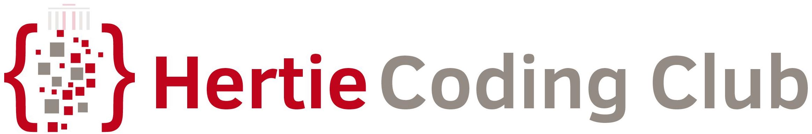

 
 

<b>Instructor</b>: Jorge Roa, BA  

 

# (Re) Introduction to R

## Description

This repository provides materials for the introduction to R sessions. 

## Files

The repository is divided as follows:

📁 **session1-objects**: Rdata frames to pull for our live coding session, presentations, etc.

-    📁 **analysis**: Our R project. Open this to work with the scripts

      -   📄 answers_exercises_objects.R: Our R project. Open this to work with the scripts
      
      -   📄 exercise_objects.R: Our R project. Open this to work with the scripts
      
      -   📄 homework_objects.R: Our R project. Open this to work with the scripts
      
      -   📄 session1_objects.R: Our R project. Open this to work with the scripts

-   📄 session1-objects.Rproj: Our R project. Open this to work with the scripts

   

📁 **session2-dataframes**: Markdowns with exercises.

-   📄 Exercise quanteda: Exercise quanteda_cleaned.Rmd
   
-   📄 Exercise quanteda with answers: Exercise quanteda.Rmd

📁 **live-coding-session**: files that contains a markdown with the live coding session. 

-   📄 Exercise quanteda with answers: How_we_met_quanteda.html

📁 **quarto**: our main presentation to introduce the topic in quarto presentation.

-   📄 Quanteda_presentation_final_version.html (We will have two parts for the live coding session: a Markdown and this presentation).

📁 **scripts**: raw data file of our live code session for the persons that are interested. 

-   📄 01_raw_script.R

📁 **texts**: How I Met Your Mother TV scripts. 
